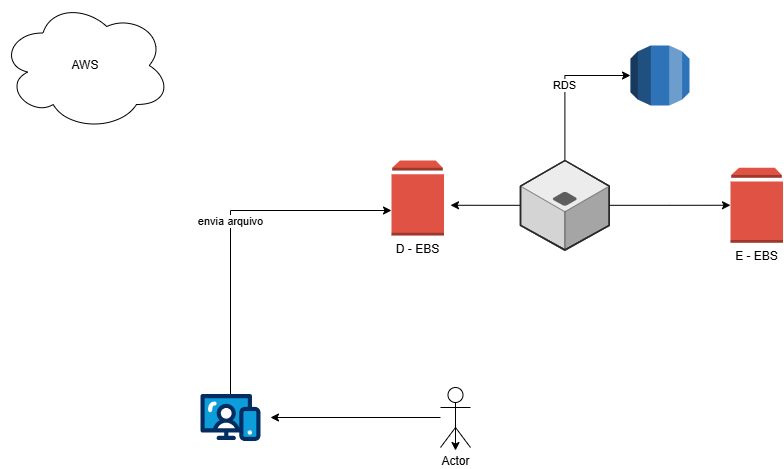

# gerenciamento-ec2-aws

# Gerenciamento de Instâncias EC2 - DIO

## Descrição do Projeto
Este repositório documenta a prática de gerenciamento de instâncias EC2 na AWS, realizada como parte do desafio da DIO. O objetivo é consolidar os conceitos aprendidos durante as aulas, aplicando-os em um ambiente prático e registrando insights e processos técnicos.

O projeto também demonstra a capacidade de documentação organizada e compartilhamento de conhecimento através do GitHub.

---

## Estrutura do Repositório
- `images/` - Contém capturas de tela e diagramas do ambiente EC2.
- `notas/` - Arquivos com anotações, aprendizados e insights das aulas (opcional).
- `scripts/` - Comandos ou scripts utilizados para gerenciamento das instâncias EC2 (opcional).

---

## Diagrama do Ambiente EC2

O diagrama representa a arquitetura e configuração das instâncias EC2 utilizadas no laboratório, incluindo:
- Usuário final enviando arquivos para a instância
- Instâncias EC2 configuradas
- Banco de dados RDS
- Comunicação dentro da AWS

---

## Principais Aprendizados
- Criação e configuração de instâncias EC2 na AWS.
- Entendimento dos tipos de instâncias, regiões e zonas de disponibilidade.
- Configuração de grupos de segurança e regras de firewall.
- Importância do uso de tags para organização e gerenciamento das instâncias.
- Monitoramento do desempenho de instâncias para otimização de custos.
- Aplicação do modelo de responsabilidade compartilhada da AWS: a AWS garante a segurança da nuvem, enquanto o cliente é responsável pela segurança **na** nuvem.

---

## Insights Adicionais
1. Planejar a região correta da instância afeta latência e conformidade.
2. Registrar comandos e processos técnicos ajuda na manutenção e futuras implementações.
3. Scripts e automações simplificam a administração de múltiplas instâncias EC2.
4. Documentar o aprendizado melhora a compreensão e serve como material de referência.

---

## Como Contribuir
Este repositório é destinado à documentação pessoal do desafio DIO, mas sugestões e melhorias são bem-vindas via Pull Requests.

---

## Referências
- [Documentação Oficial AWS EC2](https://docs.aws.amazon.com/ec2/index.html)
- [Guia de Markdown do GitHub](https://guides.github.com/features/mastering-markdown/)
- [GitHub Docs](https://docs.github.com/)

